# The modular scenario runtime

This is the developer guide to scenario runtime v2: what it is, how a campaign
gets from Providence into a running game, where the important boundaries are,
and how this differs from Samuel Rabreau's earlier implementation in the Realmz
Castle repository.

The short version is that I want scenarios to be **content the engine
interprets**, not a collection of campaign-specific scripts the engine happens
to execute. That one decision drives most of the architecture.

Samuel's implementation was useful. It got native Godot campaigns, map Action
Points, encounters, shops, spells, battles, and custom behavior moving quickly.
It was also very direct: a campaign shipped GDScript, that GDScript called
`GameGlobal`, `UI`, and `ScriptHelperFuncsClass`, and the game trusted it. That
is a reasonable way to prove a game loop. It is a difficult foundation for
portable Classic scenarios, deterministic Providence exports, safe third-party
packages, resumable scenario execution, and multiple selectable gameplay
models.

Runtime v2 keeps the parts of the Remake that already work well--the map, HUD,
combat system, inventory, characters, audio, and save UI--but puts a versioned
scenario VM and explicit engine APIs in front of them.

This guide describes the implementation after the
`refactor/scenario-runtime-domain-extraction` branch. The package, VM, handler,
port, extension, rules, and save contracts did not change during that
refactoring. The important change is that the two large POC implementation
seams were split into domain runtimes and domain Godot services while keeping
those public contracts stable.

> **Scope of this guide**
>
> "Samuel's implementation" means the Realmz Castle `Realmz-Remake`
> `origin/dev` tree at commit `f44a53dfb2d62dcf9783b31d9a9f0b6241394c23`
> (`Wolf Morph, improved Status AI functions`, authored by Samuel Rabreau).
> The `core.samuel` rules preset is an experimental set of implemented
> Samuel-style differences characterized against that baseline. It does not
> claim complete native parity, and it does not reload or re-enable the old
> campaign scripts.

## The mental model

There are three different things here, and keeping them separate makes the
whole system much easier to understand:

1. **The scenario package** says what was authored. It contains maps, messages,
   encounters, Classic actions, media, provenance, and runtime declarations.
2. **The scenario runtime** decides what instruction runs next, what owns that
   instruction, when execution must pause, and how it resumes.
3. **The Godot game** actually draws a picture, opens a shop, moves the party,
   starts combat, changes a character, or saves state.

The normal flow looks like this:

```mermaid
flowchart LR
    P["Providence project"] --> B["Scenario v2 package"]
    B --> I["Install, validate, and index"]
    I --> S["Campaign session and pinned rules"]
    S --> VM["ScenarioInterpreter"]
    VM --> H["One registered instruction handler"]
    H --> R["ScenarioStepResult"]
    R -->|continue or branch| VM
    R -->|yield command| HOST["ClassicRuntimeHost"]
    HOST --> PORT["One command port"]
    PORT --> DOMAIN["One domain Godot service"]
    DOMAIN --> G["ScenarioGodotServices coordinator"]
    G --> GAME["Map, HUD, combat, inventory, characters"]
    GAME -->|structured response| HOST
    HOST --> VM
```



This is not a second game engine living beside Godot. The scenario side owns
authored execution and continuation. The existing Godot side still owns game
objects and presentation.

## A quick vocabulary pass

| Term | What it means here |
| --- | --- |
| **Classic action** | A preserved Realmz action slot with a signed raw opcode, normalized opcode, record ID, slot, GOSUB flag, and source evidence. |
| **Semantic operation** | A namespaced runtime-v2 instruction such as `scenario.example.open_portal`. It is not limited to the original Classic opcode table. |
| **Trigger** | A stable, indexed action list. A map AP, XAP, encounter result, timed event, or battle macro can all resolve to a trigger. |
| **Handler** | The one registered owner of an opcode or semantic operation. A handler decides what that instruction means. |
| **Step result** | The handler's control-flow answer: continue, yield, branch, call, return, replace, halt, or error. |
| **Command** | A request for the Godot side to do something, such as show text, start a battle, check an item, or teleport. |
| **Port** | The single owner and validator for a family of commands crossing into Godot. |
| **Service** | The domain-specific Godot implementation behind a port. It can use shared native helpers from the services coordinator. |
| **Continuation** | The saved identity and data required to resume the exact handler that yielded. |
| **Runtime state** | Mutable scenario state: AP replacements, quest state, map mutations, encounter changes, timed events, and similar campaign-owned changes. |
| **Gameplay ruleset** | Six resolved domain providers plus validated options, chosen at new-game time and locked into the save. |
| **Extension** | Trusted engine code registered in Remake's built-in extension catalog. A campaign can require and configure it, but cannot supply the code. |

## The architecture, layer by layer

### 1. Providence produces a versioned, data-only package

The runtime consumes `realmz-remake-scenario` format 2. Providence's editable
project and native Realmz export are separate artifacts; neither is treated as
the Remake runtime package.

Every installed package starts with `campaign.json` and names nine JSON
documents:

| Document | Main responsibility |
| --- | --- |
| `classic/scenario.json` | Scenario identity and Classic shell metadata |
| `classic/maps.json` | Land and dungeon maps and player-map records |
| `classic/scripts.json` | Triggers, Extra Codes, messages, and random levels |
| `classic/encounters.json` | Battles, treasure, shops, and encounter records |
| `classic/content.json` | Monsters, scenario items, and item text |
| `classic/rules.json` | Spell, race, and caste definitions |
| `classic/assets.json` | Packaged payload and runtime-media catalogs |
| `classic/evidence.json` | Source observations and execution evidence |
| `runtime.json` | Rules recommendation, extensions, bindings, and target support |

The detailed interchange rules live in
[BUNDLE_CONTRACT.md](BUNDLE_CONTRACT.md). The important architectural rule is
that **array position is never identity**. Records have stable IDs, and
references are validated before the runtime indexes them.

A Classic instruction is explicit data:

```json
{
  "kind": "classic",
  "slot": 0,
  "rawCode": -42,
  "code": 42,
  "id": 17,
  "gosub": true
}
```

A Remake-specific operation uses the same instruction stream but is namespaced:

```json
{
  "kind": "semantic",
  "slot": 1,
  "operation": "scenario.example.open_portal",
  "parameters": {
    "destination": "vault"
  }
}
```

Neither form points at a campaign GDScript path.

### 2. Installation is a real trust and readiness boundary

`ClassicCampaignInstall` is not just a folder loader. It:

1. accepts only a safe installed campaign directory name;
2. requires `campaign.json`;
3. recursively rejects symlinks and executable payloads;
4. loads and validates the complete bundle;
5. verifies packaged asset byte counts and hashes;
6. builds the same native resource context used by campaign selection;
7. runs readiness against that context; and
8. verifies that the materialized start map exists.

The forbidden package types include GDScript, PCK files, native libraries,
executables, and WebAssembly. A campaign with `map_scripts.gd` is not "mostly
valid"; it is outside the v2 trust model.

This matters for more than security. It also means the runtime can reason about
what a package requires before the player starts it. Missing media, unsupported
records, invalid IDs, unknown extensions, and progression blockers become
diagnostics instead of a late dynamic-call failure.

The campaign selector lists only manifest-bearing scenario-v2 directories.
Legacy native campaign folders can remain in the repository as source fixtures,
but the game does not execute them.

### 3. `ClassicCampaignBundle` is immutable product input

`ClassicCampaignBundle` validates all nine documents and builds lookup indexes
for triggers, maps, messages, encounters, monsters, items, pictures, sounds,
random rectangles, and other source records.

Once loaded, code should treat the bundle as immutable. If an action changes an
AP, removes an encounter option, rewrites a tile, or alters a timed event, that
change belongs in `ClassicRuntimeState`.

That separation is deliberate:

- the bundle continues to describe what Providence exported;
- runtime state describes what this playthrough changed;
- a save can serialize only mutations rather than rewritten campaign files;
- tests can compare source data and effective state independently; and
- loading a save never edits the installed package.

### 4. `ClassicCampaignSession` owns one playthrough

`ClassicCampaignSession` is the aggregate for a running campaign. It:

- uses the already validated install;
- resolves the selected gameplay rules;
- creates and configures the runtime host;
- loads materialized item definitions;
- applies campaign character rules;
- activates the authored start location;
- drains timed-encounter scans after native time advances; and
- creates and restores the complete scenario save envelope.

`GameGlobal.start_current_classic_campaign()` is the normal engine entry point.
It creates a session with `ScenarioGodotServices`, restores a schema-3 save when
present, applies character rules, activates the start location, and registers
the session's host for map and combat integration.

The distinction between **session** and **host** is useful:

- the session owns campaign lifecycle, rules, time scheduling, and aggregate
  persistence;
- the host owns one active scenario execution and its command round trips.

### 5. `ScenarioInterpreter` is the public execution owner

Every scenario action now enters `ScenarioInterpreter`. The interpreter owns
or exposes the important execution facts:

- current trigger and action position;
- call/GOSUB frames;
- encounter origins;
- the pending command;
- execution context;
- trace output;
- halted/completed state;
- step and stack limits; and
- execution snapshots and restoration.

For Classic execution, those mutable facts live in
`ClassicScenarioExecutionState`, which the interpreter creates and owns.
`ClassicOpcodeRuntime` is bound to that state; it does not create a second
cursor, stack, trace, or continuation store. Keeping the state object explicit
also gives snapshots and restoration one concrete schema boundary.

There are two instruction shapes, but not two campaign execution systems.
Generic semantic triggers and preserved Classic triggers both resolve through
`ScenarioInstructionRegistry`. Classic execution uses
`ClassicOpcodeRuntime` as a compatibility coordinator for shared bundle access,
state proxies, cursor lifecycle, and the unusual original stack behavior. The
actual opcode mechanics are split across eight handler-aligned domain runtimes.
The VM still resolves the registered handler before a mechanic can run,
captures the yield as a `ScenarioPendingCommand`, and owns the public resume
path.

There is only one execution loop. The old loop inside
`ClassicOpcodeRuntime` has been removed. The active path is:

1. normalize the instruction;
2. ask the registry for its one owner;
3. fail if no owner exists, except for an evidence-listed original dispatcher
   no-op;
4. ask `ClassicOpcodeRuntime` for that handler's domain runtime;
5. execute the mechanic through the registered handler;
6. apply or capture its `ScenarioStepResult`; and
7. continue until the VM yields, completes, or errors.

The hard limits are intentional. The VM stops after 256 internal steps instead
of hanging, and Classic GOSUB depth is capped at 20 frames instead of writing
past the original fixed array.

### 6. Handler families own meaning

`CoreScenarioHandlerCatalog` registers the built-in handler families:

| Handler ID | Domain |
| --- | --- |
| `core.control-flow` | AP replacement, branches, calls, returns, and encounter-flow changes |
| `core.encounters` | Simple and complex encounter operations |
| `core.map-time` | Map mutation, teleporting, time, darkness, view, and random rectangles |
| `core.combat` | Battle requests, battle state, macros, morale, and combatant mutations |
| `core.inventory` | Treasure, shops, temples, banking, items, charges, and equipment storage |
| `core.character` | Character selection, abilities, health, experience, allies, and conditions |
| `core.rules-state` | Scenario rule and persistent state operations |
| `core.presentation` | Text, pictures, sound, clicks, and presentation branches |

Each Classic opcode is registered once. Duplicate ownership is a startup error,
and non-core extensions cannot claim Classic opcodes.

Handlers should answer in `ScenarioStepResult`, not manipulate the VM's
instruction pointer themselves. The result vocabulary is intentionally small:

| Result | Meaning |
| --- | --- |
| `continue` | Advance to the next instruction |
| `yield` | Ask Godot to perform one command and save a continuation |
| `branch` | Continue at another action index |
| `call` | Push a frame and enter another trigger |
| `return` | Pop a frame |
| `replace` | Enter another trigger without pushing a frame |
| `halt` | Finish intentionally |
| `error` | Stop with a developer- and source-visible failure |

Classic handlers currently call focused mechanics on
their matching domain runtime:

| Handler | Mechanic implementation |
| --- | --- |
| `core.control-flow` | `ClassicControlFlowOpcodeRuntime` |
| `core.encounters` | `ClassicEncounterOpcodeRuntime` |
| `core.map-time` | `ClassicMapTimeOpcodeRuntime` |
| `core.combat` | `ClassicCombatOpcodeRuntime` |
| `core.inventory` | `ClassicInventoryOpcodeRuntime` |
| `core.character` | `ClassicCharacterOpcodeRuntime` |
| `core.rules-state` | `ClassicRulesStateOpcodeRuntime` |
| `core.presentation` | `ClassicPresentationOpcodeRuntime` |

Those objects own the complicated source-fidelity mechanics: signed opcodes,
encounter result blocks, AP/XAP replacement, Classic selection tracking, GOSUB
quirks, source-specific branching, combat macros, and mutation ordering.
`ClassicOpcodeRuntime.classic_handler_runtime()` is the narrow coordinator that
maps a registered core handler to its mechanic object and supplies shared
bundle/state helpers. The handler owns instruction dispatch, the domain runtime
owns the mechanic, `ClassicScenarioExecutionState` owns mutable execution
facts, and `ScenarioInterpreter` owns the loop.

### 7. A yield becomes one structured pending command

Most interesting scenario actions cannot finish synchronously. Text waits for
acknowledgement. Choices need an answer. Encounters need an outcome. Battles
may take several minutes. Character selection and item checks need native game
state.

When a handler yields, the VM creates one `ScenarioPendingCommand` containing:

- the handler ID that yielded;
- the command ID;
- stable action identity; and
- structured continuation data.

On response, the VM looks up that same handler by ID and calls its `resume`
method. It does not use a giant host-side switch to guess which opcode a command
belonged to.

Classic mechanics still expose properties such as `pending_choice` and
`pending_battle` for focused source-fidelity tests. Those are compatibility
views over the active Classic mechanic. The serialized scenario-level identity
is the single pending-command record.

### 8. `ClassicRuntimeHost` drives the asynchronous round trip

The host connects the runtime's signals to the command router:

1. a map AP calls `run_trigger()`;
2. the runtime runs instructions until one yields;
3. `command_requested` reaches the host;
4. the host merges map/combat execution context into the request;
5. `ScenarioCommandRouter` sends the command to its owning port;
6. the port awaits the Godot service response;
7. the host sends that response back to the runtime; and
8. the VM resumes through the handler recorded in the pending command.

The host also handles nested battle macros. A map AP may be suspended inside
`start_battle` while a separate host runs a battle-round or queued combat macro
against the same immutable bundle and shared runtime state. That keeps the outer
AP continuation intact.

### 9. Six ports are the engine API

The ports are the most practical boundary in the system. If a scenario action
needs the Godot game to do something, it should cross one of these:

| Port | Owns |
| --- | --- |
| `MapPort` | Map redraw and mutation, teleporting, party movement, time, camping, view state, darkness, random rectangles, land looks, and player maps |
| `CombatPort` | Battle construction, combatant queries and mutations, macros, turning, battle end, rewards, and coward penalties |
| `InventoryPort` | Treasure, item drops, shops, temples, banking, identity-aware checks and mutations, wealth, equipment storage, and inventory save state |
| `CharacterPort` | Fatigue, conditions, allies, experience, character picking, ability checks, health, and field spell integration |
| `PresentationPort` | Text, scrolling text, choices, encounters, sound, authored waits, pictures, and random-branch presentation |
| `PersistencePort` | Aggregate port snapshots and restoration |

`ScenarioCommandRouter` enforces:

- one port ID per port;
- one owning port per command;
- a request contract for every command;
- a response contract for every command; and
- request/response validation at the boundary.

The contract mechanism supports required fields and primitive property types,
but most core commands currently declare only an object-level contract. Treat
that as a real ownership and shape check, not as full payload schema coverage.
When changing a command, strengthen its field contract where practical instead
of describing the current shallow schema as more precise than it is.

The core command names are registered by the six default ports before any
extension port. An extension command must be declared in the trusted extension
catalog and cannot collide with an existing owner.

The five gameplay ports resolve their own native runtime during configuration.
`DelegatingScenarioPort` asks the configured coordinator for
`scenario_port_runtime(port_id)` and then validates and calls that domain
service. `PersistencePort` remains the sixth boundary and aggregates saveable
port and coordinator state rather than owning a separate gameplay service.

### 10. Domain services implement the native side

`ScenarioGodotServices` now creates five Godot-facing domain services:

| Port | Native implementation |
| --- | --- |
| `MapPort` | `ScenarioGodotMapServices` |
| `CombatPort` | `ScenarioGodotCombatServices` |
| `InventoryPort` | `ScenarioGodotInventoryServices` |
| `CharacterPort` | `ScenarioGodotCharacterServices` |
| `PresentationPort` | `ScenarioGodotPresentationServices` |

Each domain service exposes the operations for one port. A map command no
longer reflects against one all-purpose adapter; it is validated against and
executed by `ScenarioGodotMapServices`, and the same rule applies to the other
domains.

`ScenarioGodotServices` remains the coordinator and shared native owner. It
holds campaign-wide resources and cross-domain state, creates the domain
services, provides autoload/UI/native helper access, prepares save-safe command
tracking, and aggregates persistence. The domain services inherit
`ScenarioGodotDomainService` and currently call back to that coordinator for
shared helpers that have not yet moved behind narrower typed collaborators.

Neither the domain services nor the coordinator decide which command ID owns
an action, which handler should resume, or where the scenario instruction
pointer moves. Those decisions remain on the scenario side of the port
boundary.

### 11. Gameplay behavior is selected independently of execution

Runtime v2 separates **how the scenario executes** from **which gameplay model
the player selected**.

There are six rule domains:

- Map/Time
- Combat
- Inventory
- Character
- Presentation
- Persistence

`GameplayRuleRegistry` loads built-in provider descriptors and presets.
Provider options are typed (`boolean`, `enum`, `integer`, or `float`) and
validated. The new-campaign panel builds its advanced controls from that
catalog, resolves the selection, and passes it into the campaign session.

The resolved `GameplayRuleSet` stores, for every domain:

- provider ID;
- provider API version; and
- complete validated options.

That resolved set is locked into the save. A campaign can recommend
`core.classic`, but it cannot silently force a profile over the player's
selection, and an existing playthrough cannot change providers halfway through.

Both the Classic and Samuel presets use the same VM, handlers, ports, package,
and save architecture. Their defaults differ:

| Domain | `core.classic` | `core.samuel` |
| --- | --- | --- |
| Map/Time | Adjacent edge transitions, timed encounters, and random rectangles enabled | Blocked edges, timed encounters disabled, and random rectangles disabled |
| Combat | Battle macros and Classic morale | No Classic battle macros or Classic morale |
| Inventory | Scenario-stable item identity | Native-name item identity |
| Character | Classic conditions | No Classic conditions |
| Presentation | Authored click waits | Skipped authored waits |
| Persistence | Continuation saves | Saving waits for the current scenario action to finish |

The Samuel preset is an experimental compatibility profile, not a fork of the
runtime or a claim that every native behavior has been reproduced.
Mixing providers is also supported. A developer can use Classic map/time with
Samuel presentation, for example, and the resolved combination remains explicit
in the save.

Every option exposed by the catalog has a live consumer. The current runtime reads
`edgeTransitions`, `timedEncounters`, `randomRectangles`, `battleMacros`,
`classicMorale`, `itemIdentity`, `classicConditions`,
`waitForAuthoredClicks`, and `continuationSaves`. Movement-time rate,
initiative, unique-item enforcement, character statistics, general presentation
pacing, and content-hash policy are not exposed as selectable levers until they
have distinct live implementations.

### 12. Extensions are trusted engine modules, not package scripts

Some scenarios need behavior that does not belong in the original opcode table.
Runtime v2 supports that without reopening arbitrary campaign code execution.

The built-in extension catalog can declare:

- semantic instruction handlers;
- command ports;
- spells;
- item behaviors;
- encounter resolvers;
- monster AI providers;
- lifecycle hooks; and
- gameplay-rule providers.

An installed campaign's `runtime.json` can require an extension by namespaced
ID and exact API version, provide validated configuration, and bind scenario
identities to capabilities exposed by that extension.

The code still ships with Remake under
`res://scripts/scenario_runtime/extensions`. `ScenarioExtensionRegistry`
rejects script paths outside that trusted directory, rejects extension use of
the reserved `core.` namespace, and rejects duplicate bindings.

That gives us a reviewable modding surface:

- scenario authors work with declared IDs and data;
- engine maintainers review the code once;
- packages remain portable and data-only; and
- missing or incompatible extensions fail during validation instead of halfway
  through a playthrough.

The `scenario.runtime-fixture` extension is deliberately small and boring. It
exists to exercise every extension surface in tests and to give Providence an
authoritative catalog fixture.

### 13. Persistence is an aggregate, not a bag of global variables

Scenario save schema 3 contains:

- immutable campaign ID;
- `ClassicRuntimeState`;
- state owned by saveable ports;
- VM continuation state, including the single pending command; and
- the complete pinned gameplay ruleset.

Save and package compatibility are separate. A package can still validate while
being incompatible with an old save because record identities or behavior
changed.

Restore is transactional at the session level. It validates the envelope and
rules, captures current runtime/port/continuation state, restores each
component, and rolls back if port or continuation restoration fails.

Not every yield is safely replayable. The runtime allows continuation saves at
known boundaries such as text, choices, encounters, battles, authored waits,
random-branch presentation, and priest turning. It refuses a save during
operations whose side effects cannot be replayed safely.

Bundle v1 and saves before schema 3 are intentionally rejected. The upgrade path
is to re-export the scenario through Providence and start a new playthrough.

## What actually happens when the party steps on an AP

Here is the concrete map path:

1. `ClassicMapMaterializer` turns a compiled trigger coordinate into the
   existing map rectangle shape. Its `scriptToLoad` value is the trigger's
   stable ID, not a function name.
2. `game_state.gd` detects that rectangle through the normal movement path.
3. `GameGlobal.dispatch_classic_map_script()` verifies that the registered
   runtime host has that trigger.
4. The host starts the trigger with map position and native execution context.
5. `ScenarioInterpreter` asks `ScenarioInstructionRegistry` for the owner of
   each instruction.
6. The handler runs its domain opcode runtime and either completes a source-side
   mechanic or yields a Godot command.
7. The owning port calls its domain Godot service, which can use shared native
   helpers from `ScenarioGodotServices`.
8. The response resumes the same handler.
9. When the trigger completes, the host clears the active execution and the map
   refreshes through the existing game flow.

There is deliberately no fallback to:

```gdscript
GameGlobal.map.mapscripts.call(script_name)
```

If a materialized scenario trigger is not registered with the VM, the game
reports an error. It does not reinterpret the trigger ID as executable
GDScript.

## What actually happens when an action starts a battle

Battle is the easiest way to see why continuations matter:

1. A combat handler resolves the Classic battle action.
2. It yields `start_battle` with the authored battle identity and context.
3. `CombatPort` validates and routes the request.
4. `ScenarioGodotCombatServices` materializes or loads the native battle,
   using shared coordinator helpers where needed, and enters the existing
   combat state.
5. The outer scenario execution remains suspended with its handler, action
   identity, and continuation data intact.
6. Battle-round and queued macros can run through nested hosts while sharing
   campaign runtime state.
7. Native combat reports victory, cowardice, selective survivors, or another
   supported outcome.
8. The recorded combat handler resumes the outer action and applies the
   authored branch, penalty, reward, or fallthrough.

Samuel's scripts achieved the surface flow with `await
ScriptHelperFuncsClass.start_battle_in_range(...)`. Runtime v2 makes the state
on both sides of that `await` explicit and save-aware.

## Samuel's architecture in concrete terms

At the comparison baseline, Samuel's campaign model consisted of native asset
and JSON files plus executable campaign GDScript.

The game loaded:

- `on_select.gd` for description, party limit, and admission checks;
- `on_campaign_start.gd` for start position, time, maps, and timed encounters;
- `campaign_global_script.gd` for campaign globals and time callbacks;
- `shops.gd` for shop construction;
- `Maps/<map>/map_scripts.gd` for AP/XAP functions;
- `Special Encounters/*.gd` for encounter UI callbacks;
- `CreatureScripts/*.gd` for campaign AI;
- campaign spell GDScript; and
- script source embedded in battle JSON, compiled at runtime with
  `GDScript.new()`.

`Resources.gd` stored the loaded map GDScript beside each map. The state machine
looked up a string such as `AP0x9y17`, called that function dynamically, awaited
it, and treated a returned string as the name of the next function to call.

A generated AP commonly looked conceptually like this:

```gdscript
static func AP1x8y16():
    await ScriptHelperFuncsClass.display_text_wait_noise("...", "message nod.wav")
    var branch = ScriptHelperFuncsClass.branch_item_possession_divinity(...)
    if not branch.is_empty():
        return branch
```

The script was free to call helpers, edit `GameGlobal`, open UI directly, set a
shop string, alter minimaps, or return another script name.

This was not a tiny amount of glue. In the pinned baseline:

- `src/Campaigns` contained 53 campaign GDScript files;
- 22 of those were `map_scripts.gd`;
- 13 were special-encounter scripts; and
- City of Bywater's `map_0/map_scripts.gd` alone was 2,488 lines with 263
  AP/XAP functions, 1,002 `ScriptHelperFuncsClass` references, and 43 direct
  `GameGlobal` references.

The current compiled Classic campaign directories contain zero GDScript files.
City of Bywater's manifest instead inventories 1,341 trigger records, 882 active
triggers, and 5,282 Extra Code records as data.

## Old and new side by side

| Concern | Samuel baseline | Scenario runtime v2 |
| --- | --- | --- |
| Campaign unit | Native folder containing JSON, media, and executable GDScript | Versioned, self-contained, data-only scenario package |
| Producer | Hand-authored or generated Godot campaign files | Providence canonical project exported through a documented contract |
| Discovery | List directories and load `on_select.gd` | List only safe directories with a valid v2 manifest |
| AP identity | GDScript function name such as `AP1x8y16` | Stable trigger ID with source and record identity |
| Dispatch | Dynamic `mapscripts.call(function_name)` | Registry resolves a supported instruction to one handler and rejects an unowned instruction |
| Branching | Return another function-name string | Typed branch/call/return/replace result |
| Asynchronous work | Godot coroutine and `await` inside campaign code | Explicit yield, command, pending record, structured response, and handler resume |
| Engine access | Campaign scripts call globals, UI, helpers, and nodes directly | Commands cross one validated port into Godot services |
| Mutable campaign state | General `stuff_done`, globals, native objects, and script convention | Immutable bundle plus owned `ClassicRuntimeState` and port state |
| Saving mid-action | No serialized VM instruction or continuation identity | Versioned VM snapshot and replayable pending command |
| Shops | Campaign-provided `shops.gd` plus global shop state | Compiled shop records through `InventoryPort` and native inventory services |
| Encounters | Instantiated campaign GDScript objects with UI callbacks | Indexed encounter data plus handlers, commands, and trusted bindings |
| Battle scripts | Campaign GDScript or source compiled from JSON | Indexed Classic actions and engine-owned combat handlers |
| Spell/item/AI customization | Load a campaign script path | Bind an identity to a trusted built-in extension capability |
| Behavior profiles | Whatever the campaign script and current globals implement | Six independently selectable, typed, save-pinned rule domains |
| Failure mode | Missing method, bad script path, invalid dynamic call, or partial mutation | Contract/readiness error, unowned instruction, invalid command, or validated restore failure |
| Security boundary | Campaign is trusted code | Campaign is untrusted data; extension code ships with Remake |
| Testing | Exercise a campaign script through the live game | Contract, registry, VM, port, fixture, source corpus, integration, and route acceptance layers |

The important difference is not simply "JSON instead of GDScript." JSON can
still become a mess if every consumer guesses what it means. The real
difference is **explicit ownership and state**.

## Why I consider the new boundary worth the extra structure

### Portable campaigns

Providence can emit the same deterministic runtime artifact for desktop and
browser workflows. The package does not depend on a local Godot script path or
the exact shape of a scene tree.

### Safer third-party distribution

A package cannot execute arbitrary filesystem, network, process, or engine
operations through GDScript. New executable behavior goes through normal Remake
review as a built-in extension.

### Better Classic fidelity work

The bundle preserves raw action identity and evidence. The runtime can say
"opcode 56 at Data DD record 7 slot 3 is unsupported" rather than "some map
function returned the wrong thing." Mutations remain separate from the
preserved source record.

### Real continuation saves

The runtime knows exactly where execution paused, which handler owns the pause,
what command was issued, and which data is needed to resume. That is much more
reliable than trying to reconstruct a suspended GDScript coroutine from global
state.

### Testable subsystems

A handler and its domain runtime can be tested without a HUD. A port can be
tested with a service double. A domain Godot service can be characterized
without exposing unrelated port commands. A bundle can be validated without
starting a game. A route test can still exercise the complete native stack
when that is the claim we need.

### Selectable behavior without campaign forks

Classic fidelity and Samuel-style defaults are data-driven profiles over the
same runtime. We do not need one copy of a scenario for each rules combination.

## Where to make a change

This is the practical part I expect developers to come back to.

### I need to fix or add a Classic opcode

1. Find its owner in `scripts/scenario_runtime/handlers`.
2. If no family owns it yet, add it to the narrowest matching handler's opcode
   list. Do not add a second dispatcher.
3. Put source-specific calculations in that handler family's
   `classic_*_opcode_runtime.gd`. Shared cursor, stack, continuation, or bundle
   plumbing belongs in `ClassicOpcodeRuntime` only when more than one domain
   genuinely needs it.
4. If it needs native game state, yield a command instead of reaching into
   `GameGlobal` from the handler.
5. Add that command to exactly one port, with request and response contracts.
6. Reuse or add a focused method in the matching
   `ScenarioGodot*Services` domain service. Keep coordinator access limited to
   shared native concerns.
7. Add a source-backed fixture with exact record/slot evidence.
8. Add a native integration or route smoke if the claim crosses map, UI,
   inventory, combat, media, or persistence.
9. Update the compatibility guide only to the level the evidence proves.

Do not mark an opcode "supported" because it resolves to a handler. Handler
presence proves routing, not correct behavior across every authored form.

### I need a new core Godot command

1. Choose the owning port by domain.
2. Add the command ID once.
3. Define its request and response contracts.
4. Map it to a method on that port's domain Godot service.
5. Keep scenario continuation out of the service.
6. Test duplicate ownership and malformed request/response behavior where
   relevant.

If two ports both seem to own the command, the domain boundary probably needs a
small design decision before coding.

### I need scenario-specific behavior beyond Classic opcodes

Use a trusted extension:

1. choose a stable namespaced extension ID;
2. declare its capabilities in `extensions/catalog.json`;
3. add a handler, port, or provider below
   `scripts/scenario_runtime/extensions`;
4. declare the required extension and API version in `runtime.json`;
5. bind the scenario identity to the declared capability;
6. make Providence record `nativeRealmz: false` and a reason when the behavior
   cannot be represented in native Realmz; and
7. add conformance tests for validation, invocation, and missing-extension
   failure.

Do not put a `.gd` file in the campaign folder. The installer will reject it,
as intended.

### I need a new gameplay option or provider

1. Decide which of the six domains owns the behavior.
2. Add a typed option or provider descriptor to `rules/catalog.json`.
3. Enforce it at the port or other domain boundary where the behavior actually
   happens.
4. Confirm the new-campaign UI renders and resolves it.
5. Confirm the ruleset snapshot includes its resolved value.
6. Confirm restore rejects missing providers or incompatible API versions.

Changing a catalog default changes new playthroughs. It does not rewrite a
ruleset already pinned into a save.

### I need to change the package format

This is a coordinated Providence-and-Remake change:

1. update the written bundle contract;
2. update Providence's canonical project/export model;
3. update deterministic exporter tests;
4. update `ClassicCampaignBundle` validation and indexing;
5. update readiness and runtime consumers;
6. run the cross-repository verifier; and
7. decide explicitly whether the format is backward compatible.

Do not make the loader silently accept two meanings for the same version.

### I need to persist new runtime state

First decide who owns it:

- authored source stays in the bundle;
- scenario mutations go in `ClassicRuntimeState`;
- subsystem state goes in its owning port;
- execution position goes in the VM snapshot; and
- selected behavior goes in `GameplayRuleSet`.

Then add validation and rollback coverage. A field merely appearing in a save
dictionary is not enough; restore must reject invalid state and leave the
session usable after failure.

## A debugging route that usually works

When an AP behaves incorrectly, follow the same path the runtime follows:

1. **Bundle:** Find the trigger in `classic/scripts.json`. Confirm its source,
   record index, coordinate, active flag, percentage, action slots, and raw
   codes.
2. **Materialization:** Confirm `map_scriptareas.json` names the stable trigger
   ID at the expected coordinate.
3. **Runtime state:** Check whether the AP was disabled, replaced, moved, or
   had its percentage changed.
4. **Registry:** Confirm the normalized opcode or semantic operation resolves
   to one handler.
5. **Trace:** Confirm the expected trigger ID, action index, slot, handler ID,
   and command are present.
6. **Port:** Confirm the command belongs to the expected domain and the request
   passes its contract.
7. **Godot domain service:** Confirm the port resolved the expected domain
   service, that the service saw the expected native context, and that it
   returned a valid response. If it delegated to the coordinator, trace that
   shared helper separately.
8. **Resume:** Confirm the pending record resumes through the same handler and
   applies the authored branch.
9. **Persistence:** If the bug appears after load, compare runtime, port,
   continuation, and ruleset snapshots separately.

This is more steps than putting a breakpoint in one giant AP function, but each
step answers a specific ownership question. It also makes failures reproducible
without manually replaying the whole campaign.

## Files developers should know

| File or directory | Why it matters |
| --- | --- |
| [`classic_runtime/BUNDLE_CONTRACT.md`](BUNDLE_CONTRACT.md) | Authoritative Providence-to-Remake package contract |
| [`classic_runtime/classic_campaign_install.gd`](classic_campaign_install.gd) | Installed-package trust, payload, native-context, and readiness boundary |
| [`classic_runtime/classic_campaign_bundle.gd`](classic_campaign_bundle.gd) | Format validation, document loading, and stable indexes |
| [`classic_runtime/classic_campaign_session.gd`](classic_campaign_session.gd) | Playthrough lifecycle, rules, timed events, and aggregate save/restore |
| [`classic_runtime/classic_runtime_state.gd`](classic_runtime_state.gd) | Mutable Classic scenario state |
| [`classic_runtime/classic_runtime_host.gd`](classic_runtime_host.gd) | Active execution, nested macros, and command round trips |
| [`scenario_runtime/scenario_interpreter.gd`](../scenario_runtime/scenario_interpreter.gd) | VM, handler routing, pending commands, trace, and snapshots |
| [`scenario_runtime/classic_execution_state.gd`](../scenario_runtime/classic_execution_state.gd) | VM-owned mutable Classic cursor, stack, pending, encounter-origin, and trace state |
| [`scenario_runtime/scenario_instruction_registry.gd`](../scenario_runtime/scenario_instruction_registry.gd) | Exclusive opcode and semantic-operation ownership |
| [`scenario_runtime/handlers/`](../scenario_runtime/handlers/) | Core instruction families and Classic dispatch ownership |
| [`scenario_runtime/handlers/classic_opcode_runtime.gd`](../scenario_runtime/handlers/classic_opcode_runtime.gd) | Shared Classic compatibility coordinator, lifecycle, state proxies, and handler-runtime lookup |
| [`scenario_runtime/handlers/classic_control_flow_opcode_runtime.gd`](../scenario_runtime/handlers/classic_control_flow_opcode_runtime.gd) | AP/XAP lifecycle, branches, calls, returns, replacement, and encounter fallthrough mechanics |
| [`scenario_runtime/handlers/classic_encounter_opcode_runtime.gd`](../scenario_runtime/handlers/classic_encounter_opcode_runtime.gd) | Simple/complex encounter execution and outcome mechanics |
| [`scenario_runtime/handlers/classic_map_time_opcode_runtime.gd`](../scenario_runtime/handlers/classic_map_time_opcode_runtime.gd) | Map, movement, time, view, and random-rectangle mechanics |
| [`scenario_runtime/handlers/classic_combat_opcode_runtime.gd`](../scenario_runtime/handlers/classic_combat_opcode_runtime.gd) | Battle, combatant, macro, morale, and combat mutation mechanics |
| [`scenario_runtime/handlers/classic_inventory_opcode_runtime.gd`](../scenario_runtime/handlers/classic_inventory_opcode_runtime.gd) | Treasure, shop, wealth, item, and equipment mechanics |
| [`scenario_runtime/handlers/classic_character_opcode_runtime.gd`](../scenario_runtime/handlers/classic_character_opcode_runtime.gd) | Character selection, health, progression, condition, and ally mechanics |
| [`scenario_runtime/handlers/classic_rules_state_opcode_runtime.gd`](../scenario_runtime/handlers/classic_rules_state_opcode_runtime.gd) | Persistent rule and scenario-state mechanics |
| [`scenario_runtime/handlers/classic_presentation_opcode_runtime.gd`](../scenario_runtime/handlers/classic_presentation_opcode_runtime.gd) | Text, sound, picture, and authored-wait mechanics |
| [`scenario_runtime/scenario_step_result.gd`](../scenario_runtime/scenario_step_result.gd) | The VM control-flow vocabulary |
| [`scenario_runtime/scenario_pending_command.gd`](../scenario_runtime/scenario_pending_command.gd) | Serializable yield/resume identity |
| [`scenario_runtime/scenario_command_router.gd`](../scenario_runtime/scenario_command_router.gd) | Exclusive command ownership and boundary validation |
| [`scenario_runtime/ports/`](../scenario_runtime/ports/) | Six domain APIs into the native game |
| [`scenario_runtime/godot/scenario_godot_domain_service.gd`](../scenario_runtime/godot/scenario_godot_domain_service.gd) | Shared contract and coordinator access for native domain services |
| [`scenario_runtime/godot/`](../scenario_runtime/godot/) | Five domain services plus the shared Godot coordinator |
| [`scenario_runtime/godot/scenario_godot_services.gd`](../scenario_runtime/godot/scenario_godot_services.gd) | Campaign-wide native coordinator, shared helpers, cross-domain state, and persistence aggregation |
| [`scenario_runtime/scenario_extension_registry.gd`](../scenario_runtime/scenario_extension_registry.gd) | Trusted extension catalog, validation, and bindings |
| [`scenario_runtime/extensions/`](../scenario_runtime/extensions/) | Engine-shipped extension code and conformance fixture |
| [`scenario_runtime/gameplay_rule_registry.gd`](../scenario_runtime/gameplay_rule_registry.gd) | Provider/preset loading and resolution |
| [`scenario_runtime/rules/catalog.json`](../scenario_runtime/rules/catalog.json) | Classic, Samuel, and extension rule descriptors |
| [`classic_runtime/COMPATIBILITY_GAPS.md`](COMPATIBILITY_GAPS.md) | Evidence-backed support boundaries and open gaps |
| [`classic_runtime/CLASSIC_PORTING_GUIDE.md`](CLASSIC_PORTING_GUIDE.md) | Producer, validation, readiness, installation, and support workflow |

All paths in that table are relative to `src/scripts`.

## Invariants I do not want us to casually weaken

1. **Installed scenarios are data-only.**
2. **Every instruction has zero or one owner; zero is an explicit error unless
   source evidence marks that exact Classic slot as a dispatcher no-op.**
3. **Every command has exactly one port owner.**
4. **Campaign trigger IDs never fall through to dynamic GDScript calls.**
5. **The loaded bundle is immutable; playthrough mutations live in runtime
   state.**
6. **Array position is never used as persistent record identity.**
7. **A yield has one serializable pending-command identity.**
8. **Resume goes back through the handler that yielded.**
9. **Godot services do not own scenario instruction flow.**
10. **Extensions are additive, namespaced, engine-shipped, and unable to
    replace core ownership.**
11. **Gameplay providers and options are validated and pinned for the complete
    playthrough.**
12. **Package compatibility, readiness, component support, route acceptance,
    and campaign completion remain separate claims.**
13. **An unsupported or ambiguous source behavior fails visibly; it does not
    become a guessed success path.**

## Tests and verification

### Runtime-v2 contract tests

This is the quick architecture suite. It covers the v2 bundle contract,
extension registry, Classic and Samuel rules, handler ownership, six default
ports, VM yield/resume, dispatcher no-op evidence, built-in extension
invocation, and old-save rejection.

```powershell
Godot_v4.7.1-stable_win64_console.exe --headless --path src `
  res://scripts/scenario_runtime/tests/scenario_runtime_v2_tests.tscn
```

### Full Classic runtime suite

Use this after changing Classic mechanics, native services, continuations,
session persistence, materialization, or cross-domain behavior:

```powershell
Godot_v4.7.1-stable_win64_console.exe --headless --resolution 1100x619 `
  --path src `
  res://scripts/classic_runtime/tests/run_classic_runtime_tests.tscn
```

### Bundle validation

This proves the supplied package satisfies the consumer contract. It does not
prove the campaign is completable:

```powershell
Godot_v4.7.1-stable_win64_console.exe --headless --path src --script `
  res://scripts/classic_runtime/tests/validate_classic_bundle.gd -- `
  "F:\path\to\bundle"
```

### Regression corpus

Use the checked multi-scenario source corpus for interpreter and runtime-state
changes:

```powershell
Godot_v4.7.1-stable_win64_console.exe --headless --path src --script `
  res://scripts/classic_runtime/tests/run_classic_regression_corpus.gd
```

### Providence-to-Remake gate

Use this whenever the producer/consumer contract changes:

```powershell
powershell -ExecutionPolicy Bypass `
  -File scripts/verify_remake_classic_export.ps1 `
  -ProvidenceRoot "F:\Realmz - Providence" `
  -RemakeRoot "F:\Realmz Remake"
```

Focused component tests and route acceptance still matter. A green VM fixture
cannot prove HUD behavior, a native battle, save/reload, or campaign completion.
Use the evidence ladder in [CLASSIC_PORTING_GUIDE.md](CLASSIC_PORTING_GUIDE.md).

## The extraction is real, but the boundaries are still maturing

This branch completed the first meaningful split of both POC seams:

- the former Classic opcode implementation is now a compatibility coordinator,
  one VM-owned execution-state object, and eight handler-aligned domain
  runtimes; and
- the native command implementation is now five port-aligned Godot services
  behind a shared coordinator.

That is more than moving code into smaller files. Registered handlers now
resolve a domain mechanic object, and configured ports now resolve a domain
native service. The old duplicate Classic loop is gone, and each domain can be
reviewed and changed without searching one 4,000-line opcode implementation or
one 6,000-line command adapter.

The remaining debt is also concrete:

- `ClassicOpcodeRuntime` still exposes compatibility proxies and shared helper
  methods used by several domain runtimes;
- the Classic domain runtimes are configured with that coordinator and use
  dynamic helper invocation where the shared contract is not typed yet;
- `ScenarioGodotServices` is still a large coordinator because many shared
  constants, native-resource operations, cross-domain helpers, and persistence
  concerns remain there;
- the Godot domain services retain a `service_owner` callback for those shared
  operations; and
- `PersistencePort` aggregates state rather than having an independent native
  service.

Those seams are acceptable for this extraction, but they are not the final
shape. The next useful refactors should replace broad coordinator callbacks
with narrow typed collaborators, move truly domain-owned constants and state
to their owners, and reduce compatibility proxies only after callers and tests
use the new boundary directly.

The stable IDs, registries, VM state, pending-command schema, ports, save
contracts, and data-only package boundary are the architecture to preserve
while doing that work. File size alone is not the target; explicit ownership
is.

## Frequently asked questions

### Are scenario items, spells, or monsters supposed to become GDScript?

Usually, no. Their identity and ordinary behavior should stay in data and use
the existing item, spell, monster, and Classic materialization APIs. A genuinely
new executable mechanic belongs in a reviewed built-in extension, not in each
campaign package.

### Can a campaign still have custom behavior?

Yes. It can use preserved Classic actions, namespaced semantic operations, and
trusted extension bindings. "Data-only package" does not mean "no custom
behavior"; it means the executable implementation is versioned and shipped by
the engine.

### Does `core.samuel` run Samuel's old campaign scripts?

No. It selects a deliberately limited set of implemented Samuel-style
differences characterized against the pinned baseline. The same scenario
package still runs through runtime v2.

### Can a campaign force `core.classic`?

It can recommend it. The player selects the preset at new-game time, may mix
advanced domain providers, and the resolved ruleset is then locked into that
playthrough.

### Why reject old saves instead of migrating them?

The old save has no trustworthy VM instruction identity, pending handler,
command continuation, port aggregate, or pinned provider set. Guessing those
values would risk resuming after the wrong side effect. The current policy is
an explicit compatibility break.

### Why keep `ScriptHelperFuncsClass` and `GameGlobal` at all?

They are still useful parts of the native Remake. The rule is not "never call
them." The rule is that imported scenario instructions do not call them
directly. A domain Godot service, or the shared coordinator behind it, can reuse
proven native helpers behind a validated port.

### Why not let extensions override a core opcode?

Then a package could change the meaning of preserved Classic data based on
extension load order. Additive semantic operations are easier to validate,
reason about, save, and export back to native Realmz when possible.

### Is every Classic campaign fully supported now?

No. The architecture gives us a consistent way to add and prove support. The
compatibility gap register and scenario acceptance documents define the current
evidence. Format validity and handler coverage are not campaign-completion
proof.

## Final orientation

If you remember only one path, remember this one:

**Providence data -> validated bundle -> session and locked rules -> VM -> one
handler -> one domain mechanic -> one command port -> one domain Godot service
-> shared native coordinator when needed -> structured response -> same handler
-> saveable continuation.**

Samuel's architecture put campaign code inside the game and let it drive the
engine directly. Runtime v2 puts a stable, inspectable contract between authored
scenario behavior and the engine. It is more ceremony up front, but it gives us
the pieces we need for portable scenarios, Classic fidelity, safe distribution,
reliable saves, focused testing, and future extensions without rebuilding the
campaign system again.
